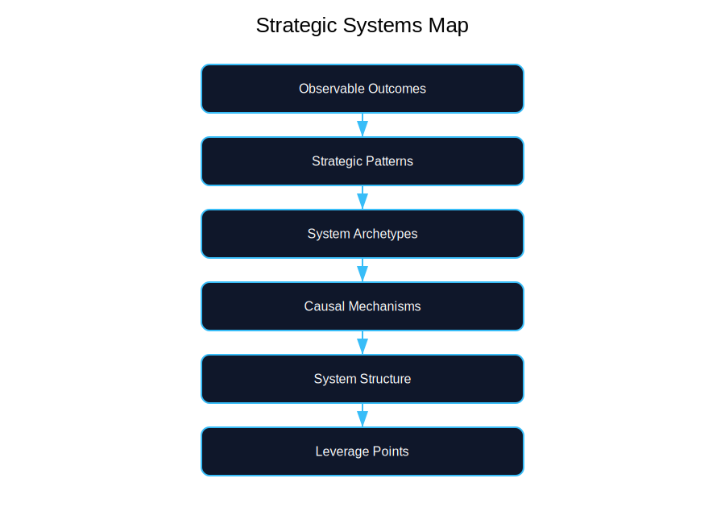
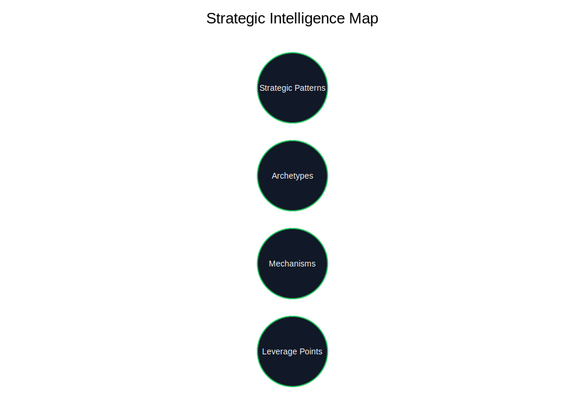
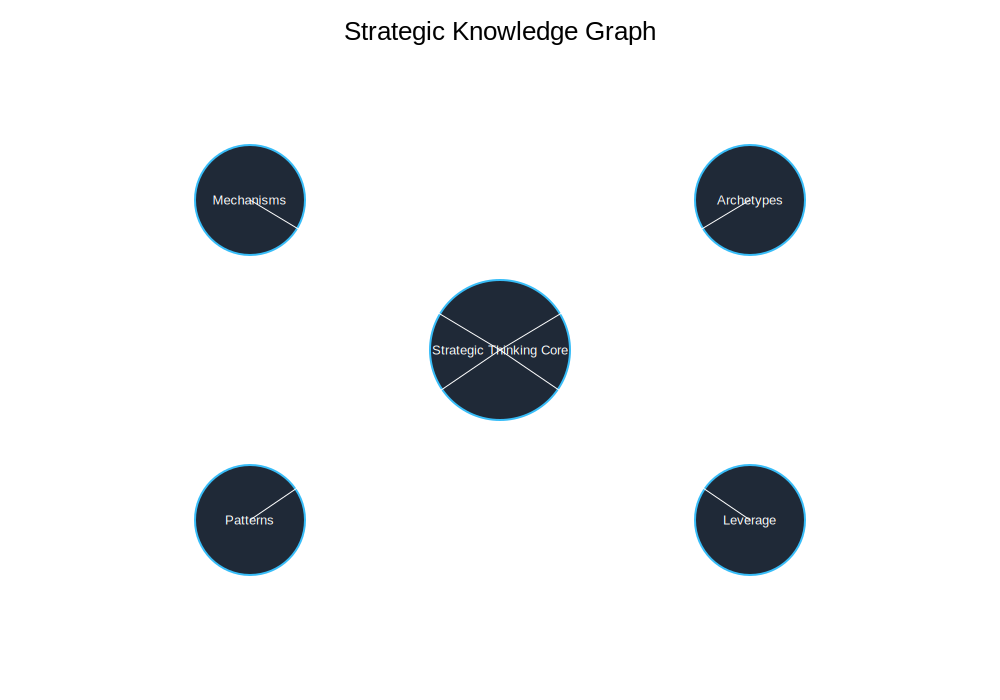
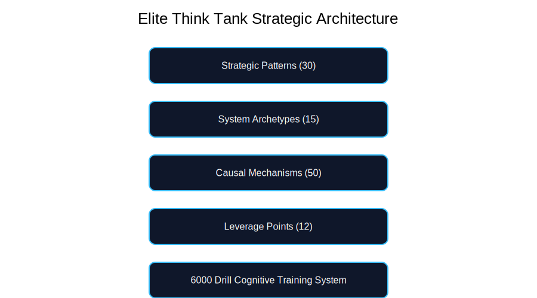

# Elite Think Tank Knowledge Portal

Welcome to the **Elite Think Tank Lab**.

This project develops a structured methodology for understanding complex systems such as:

- organizations
- technology platforms
- markets
- infrastructure systems
- ecosystems

---

# Framework Architecture

Events  
↓  
Causal Mechanisms  
↓  
System Archetypes  
↓  
System Behavior  
↓  
Strategic Diagnosis  
↓  
Strategic Intervention  

---

# Elite Think Tank Visual Maps

## Strategic Systems Map

## Strategic Intelligence Map

## Strategic Knowledge Graph

---

# Elite Think Tank Visual Framework

## Master Strategic Architecture

## Elite Think Tank Mastery Journey (0 → 6000)

## Extended Strategic Intelligence Journey (0 → 10000)

## My Personal Journey

---

# Sections

## Foundations
Introduction to systems thinking principles.

## Mechanisms
Structural forces that drive system behavior.

## Archetypes
Recurring patterns in complex systems.

## Leverage Points
Locations in systems where small changes produce large effects.

## Strategic Patterns
Recurring dynamics in markets and organizations.

## Diagnosis Playbook
Step‑by‑step method for diagnosing systems.

## Training Program
6000‑drill cognitive training program.

