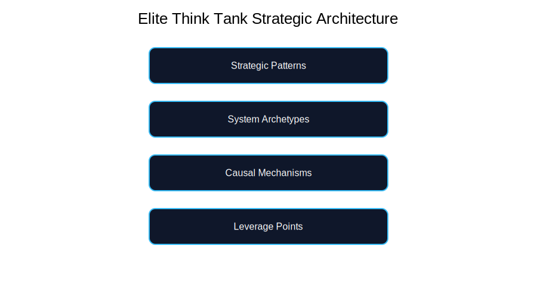

# Elite Think Tank Lab

A strategic systems thinking framework for diagnosing complex systems.

## Strategic Architecture

## Mastery Journey

---

## Framework Layers

1. Mechanisms (50)
2. System Archetypes
3. Strategic Patterns
4. Leverage Points
5. Strategic Interventions

---

## Training Dashboard

[View Dashboard](progress/dashboard.md)\
[View Weekly Dashboard](progress/weekly-progress.md)\
[View Drill Dashboard](progress/drill-history.md)

---

## Knowledge Libraries

- Mechanism → Archetype Mapping
- Archetype → Intervention Playbook
- Strategic Pattern Library
